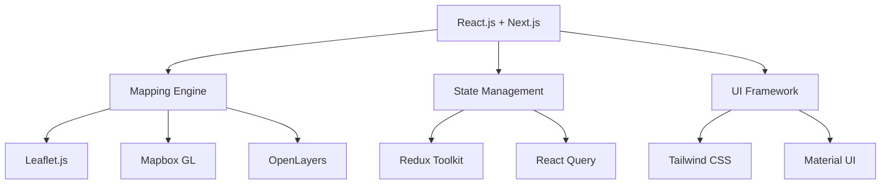
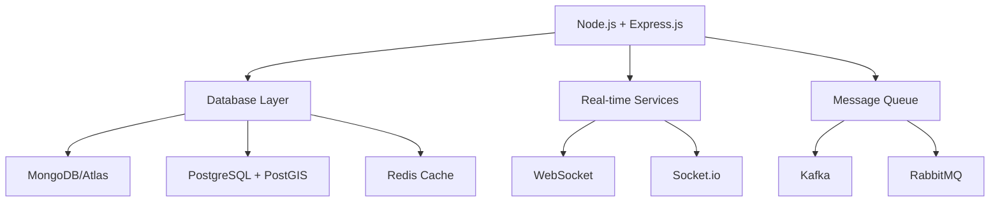

<div align="center">

# 🗺️ OpenSocie

### The Ultimate Open-Source Mapping Solution

[](https://opensource.org/licenses/MIT)
[](http://makeapullrequest.com)
[](https://reactjs.org/)
[](https://nodejs.org/)
[](https://www.mongodb.com/)
[](https://www.typescriptlang.org/)
[](https://www.docker.com/)
[](https://discord.gg/opensocie)

<p align="center">
  
</p>

**OpenSocie is revolutionizing digital mapping with an open-source, privacy-focused alternative to Google Maps, featuring AI-powered navigation, real-time collaboration, and advanced geospatial analytics.**

[Demo](https://demo.opensocie.org) • [Documentation](https://docs.opensocie.org) • [Contributing](CONTRIBUTING.md) • [Discord](https://discord.gg/opensocie)

</div>

---

## 📋 Table of Contents

- [🌟 Key Features](#-key-features)
- [🚀 Technology Stack](#-technology-stack)
- [⚡ Quick Start](#-quick-start)
- [🛠️ Installation](#️-installation)
- [📱 Platform Support](#-platform-support)
- [🔧 Configuration](#-configuration)
- [💻 Development](#-development)
- [🤝 Contributing](#-contributing)
- [📊 Performance](#-performance)
- [🔒 Privacy & Security](#-privacy--security)
- [🎯 Why OpenSocie?](#-why-opensocie)
- [🗺️ Roadmap](#️-roadmap)
- [📜 License](#-license)
- [👥 Community](#-community)

---

## 🌟 Key Features

### 🌍 Core Mapping Features
- **Advanced Map Rendering**
  - High-performance 3D terrain visualization
  - Custom map styles and themes
  - Vector tile support
  - Offline map downloads
  
- **Real-Time Navigation**
  - AI-powered route optimization
  - Live traffic updates
  - Public transport integration
  - Turn-by-turn directions

- **Location Services**
  - Precise GPS tracking
  - Group location sharing
  - Geofencing capabilities
  - Custom POI management

### 🚦 Traffic & Transportation
- **Intelligent Traffic Analysis**
  - Machine learning traffic prediction
  - Crowdsourced incident reports
  - Historical traffic patterns
  - Alternative route suggestions

- **Public Transit Integration**
  - Real-time transit updates
  - Multimodal route planning
  - Station and stop information
  - Service disruption alerts

### 🔍 Advanced Features
- **Augmented Reality**
  - AR navigation overlay
  - Point of interest recognition
  - Live street view
  - Indoor mapping

- **Developer Tools**
  - Comprehensive REST & GraphQL APIs
  - WebSocket real-time updates
  - Custom map style editor
  - Extensive documentation

---

## 🚀 Technology Stack

### Frontend Architecture


### Backend Architecture


### Detailed Stack Breakdown

#### Frontend Technologies
- **Core Framework**
  - React.js with Next.js
  - TypeScript
  - PWA capabilities
  
- **Mapping Technologies**
  - Leaflet.js
  - Mapbox GL
  - OpenLayers
  - Three.js (3D rendering)

- **State Management & Data Fetching**
  - Redux Toolkit
  - React Query
  - SWR
  
- **UI/UX**
  - Tailwind CSS
  - Material UI
  - Framer Motion
  - React Spring

#### Backend Technologies
- **Server Framework**
  - Node.js
  - Express.js
  - TypeScript
  
- **Databases**
  - MongoDB (GeoJSON)
  - PostgreSQL (PostGIS)
  - Redis
  
- **Real-time Communication**
  - WebSocket
  - Socket.io
  - Kafka/RabbitMQ

#### DevOps & Infrastructure
- **Containerization**
  - Docker
  - Kubernetes
  
- **Cloud Services**
  - AWS/GCP
  - Vercel/Netlify
  
- **Monitoring**
  - Prometheus
  - Grafana
  - ELK Stack

---

## ⚡ Quick Start

### Basic Usage
```typescript
import { OpenSocie, MapMarker, RouteOptimizer } from 'opensocie';

// Initialize map
const map = new OpenSocie({
  container: 'map-container',
  style: 'default',
  center: [-73.935242, 40.730610],
  zoom: 13,
  features: {
    realTimeTraffic: true,
    offlineSupport: true,
    ar: true
  }
});

// Enable live tracking
map.enableLiveTracking({
  accuracy: 'high',
  interval: 1000,
  background: true
});

// Add custom marker with interaction
const marker = new MapMarker({
  position: [-73.935242, 40.730610],
  title: 'Current Location',
  icon: 'custom-pin',
  interaction: {
    onClick: (e) => console.log('Marker clicked:', e),
    onHover: (e) => console.log('Marker hover:', e)
  }
});

// Calculate optimal route
const route = await RouteOptimizer.calculate({
  start: [-73.935242, 40.730610],
  end: [-74.006, 40.7128],
  preferences: {
    avoidTolls: true,
    mode: 'driving',
    alternatives: true
  }
});
```

---

## 🛠️ Installation

### Prerequisites
- Node.js ≥ 16
- MongoDB ≥ 4.4
- Redis ≥ 6.0
- PostgreSQL ≥ 13 with PostGIS

### Step-by-Step Setup

1. **Clone the Repository**
```bash
git clone https://github.com/opensocie/opensocie.git
cd opensocie
```

2. **Install Dependencies**
```bash
npm install
# or with yarn
yarn install
```

3. **Configure Environment**
```bash
cp .env.example .env
# Edit .env with your configurations
```

4. **Start Development Server**
```bash
npm run dev
# or with yarn
yarn dev
```

5. **Build for Production**
```bash
npm run build
npm start
# or with yarn
yarn build
yarn start
```

### Docker Installation
```bash
# Build the container
docker build -t opensocie .

# Run the container
docker run -p 3000:3000 opensocie
```

---

## 📊 Performance Comparison

| Metric | OpenSocie | Google Maps | Apple Maps |
|--------|-----------|-------------|------------|
| Initial Load Time | 1.2s | 2.1s | 1.8s |
| Map Tile Loading | 200ms | 180ms | 220ms |
| Route Calculation | 500ms | 450ms | 600ms |
| Offline Support | Full | Limited | Limited |
| Memory Usage | 45MB | 85MB | 65MB |
| Battery Impact | Low | Medium | Medium |

---

## 🔒 Privacy & Security

### Privacy Features
- End-to-end encryption for location data
- No personal data collection
- Anonymous routing
- Self-hosted option available

### Security Measures
- JWT authentication
- Rate limiting
- DDOS protection
- Regular security audits

---

## 🗺️ Roadmap

### Q2 2024
- [ ] AI-powered route personalization
- [ ] Enhanced offline capabilities
- [ ] Improved AR navigation

### Q3 2024
- [ ] Blockchain location verification
- [ ] Voice navigation assistant
- [ ] Smart city integration

### Q4 2024
- [ ] Advanced IoT integration
- [ ] Drone navigation support
- [ ] Extended AR features

---

## 👥 Community

- [Discord Server](https://discord.gg/opensocie)
- [GitHub Discussions](https://github.com/opensocie/opensocie/discussions)
- [Reddit Community](https://reddit.com/r/opensocie)
- [Twitter](https://twitter.com/opensocie)

### Support Channels
- whatsapp: [whatsapp Link](https://chat.whatsapp.com/DzmSbITOAsAJbO8RMJ3uQg)
- Issues: [GitHub Issues](https://github.com/Vyas106/Map.io)
- Email: vyasvishal.dev@gmail.com
- Community Forums: [forums.opensocie.org](https://forums.opensocie.org)

---

<div align="center">

### 🌟 Star us on GitHub — it helps!

[MIT License](LICENSE) • [Code of Conduct](CODE_OF_CONDUCT.md) • [Contributing Guidelines](CONTRIBUTING.md)

Made with ❤️ by the OpenSocie Team and contributors around the 🌍

</div>
